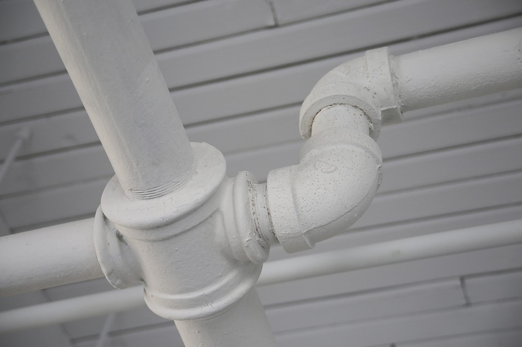

#管道

Figure: Pipes by Life-Of-Pix is licensed under Public Domain (https://pixabay.com/en/pipe-plumbing-connection-pipeline-406906/)

Angular 2提供了一种过滤数据的新方法：`pipes`。 管道是Angular 1.x的`filters`的替代品。 大多数来自Angular 1.x的内置过滤器已经转换为Angular 2管道; 一些其他简单的过滤器也可以直接使用。