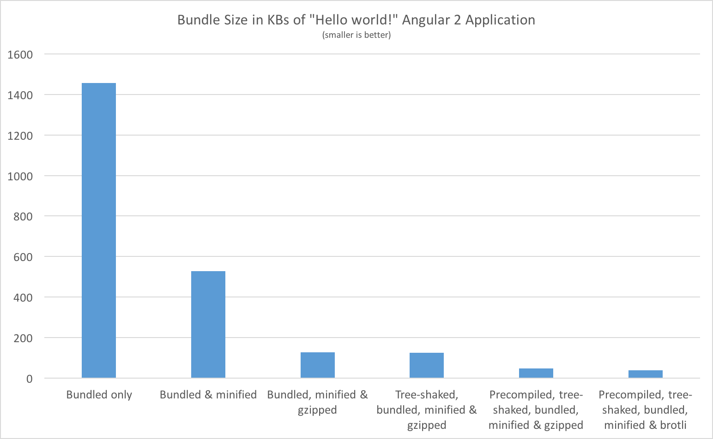

# Why Angular 2?

现在有许多前端JavaScript框架可供选择，每个都有自己的权衡。 许多人对Angular 1.x提供的功能感到满意。 Angular 2改进了该功能，使其更快，更可扩展和更现代。 在Angular 1.x中发现价值的组织将在Angular 2中找到更多的价值。

## 数据说话⚡️

这小节内容是译者加的，因为我认为对于新手而言，学习一个框架是有成本的，特别是对于一个不算简单的技术来说，我希望这篇教程是对新手**友好的**，所以我首先要让你放心的将时间和精力投入到Angular2 中。那我们先不谈技术细节，先用数据说话。

###  [谷歌趋势](https://www.google.co.jp/trends/explore?cat=31&q=angular%202,vue%202,react,angular,vue)

这里我多说一句，最近看一些文章中谷歌趋势截图，大都没有把范围限定在“**编程**”上。图中可以看出Vue2非常少，所以在下面比较中不再单独统计。

### 教程数量

这里我选取的主要是付费课程，因为付费，所以在一定程度上反应了这个框架的市场需求。教程多意味着社区庞大，企业对这方面人才有需求。如果框架冷门用的人不多，那自然不会有人去为其开发教程。

|         | Angular 2 | React | Vue  |
| :-----: | :-------: | :---: | :--: |
|  udemy  |   12*5    | 12*4  |  5   |
| egghead |    10     |  10   |  无   |
| YouTube |   99k+    | 240k+ | 39k+ |

另外还有一些独立的教程网站

[angularclass](https://angularclass.com/)

### 社区

|               | Angular 2 | React | Vue  |
| :-----------: | :-------: | :---: | :--: |
| stackoverflow |   66k+    | 80k+  | 4k+  |
|    GitHub     |   26k+    | 153k+ | 16k+ |
|     Quora     |   500+    | 1.4k+ |  30  |
|  stackshare   |  *4.7k+*  | 2.5k+ | 189  |

相信随着部分angular1.x项目迁移到2.x，应该数量会更多。

注意stackshare取的是stacks数量，但是由于其并不区分Angular版本，所以用相当一部分属于1.x版本。

### 性能

[性能测试数据](https://rawgit.com/krausest/js-framework-benchmark/master/webdriver-ts/table.html)

| angular v2.2.1 | angular v2.2.1-indexkey | react v15.4.0 | react v15.4.0-indexkey | vue v2.1.3 | vue v1.0.26 |
| :------------: | :---------------------: | :-----------: | :--------------------: | :--------: | :---------: |
|      1.43      |          1.23           |     1.39      |          1.43          |    1.37    |     1.7     |

对于前端项目而言，一般几千个数据更新基本上不会涉及到性能问题，而且移动端来说，那么小的屏幕，数据量会更少。

所以个人认为，性能并不会成为主要的选择依据，况且性能数据大家都比较接近。

### 体积

- 通过执行静态代码分析进行优化，更具体地说是tree-shaking。
- 精简（包括混淆）。
- gzip或brotli压缩。

通过上述方法，我们可以轻松地将打包大小减少到140K左右！

更多细节可以阅读[Building an Angular Application for Production](http://blog.mgechev.com/2016/06/26/tree-shaking-angular2-production-build-rollup-javascript/) 。

我想现在你可以放心的开始学习 Angular2 了🔥

## Angular 2 的优点

Angular的第一个版本为程序员提供了开发和构建大规模JavaScript应用程序的工具，但随着时代进步它逐渐显露出许多缺陷和尖锐的问题。 Angular 2正是在过去五年社区的这些反馈之上建立的。

### Angular 2 很简单

Angular 2比Angular 1.x更加现代，更有能力，更容易让新手学习，同时也更容易让项目老手使用。
使用Angular 1，开发者必须了解 Controllers, Services, Factories, Providers 和其他可能令人困惑的概念之间的差异，尤其是对于新手来说。
Angular 2是一个更流线型的框架，让开发者专注于简单地构建JavaScript类。视图和控制器被替换为组件，这可以被描述为精简版指令。甚至经验丰富的Angular程序员也不总是知道Angular1.x指令的所有功能。 Angular 2组件比起Angular 1.x的指令，它们的API特性更容易阅读。此外，为了帮助轻松过渡到Angular 2，Angular团队向Angular 1.5添加了一个`.component`方法，该方法已由社区成员Todd Motto支持到v1.3。

### TypeScript

Angular 2是用TypeScript编写的，它是一个实现许多新ES2016+特性的JavaScript超集。

通过专注于使框架更易于计算机处理，Angular 2允许更丰富的开发生态系统。 使用复杂文本编辑器（或IDE）的开发者会注意到自动完成和类型建议的显着改进。 这些改进有助于减少学习Angular 2的认知负担。幸运的是，对于传统的ES5 JavaScript程序员，这并不意味着开发必须在TypeScript或ES2015中完成：程序员仍然可以编写运行原生的JavaScript。

### **熟悉**

尽管是一个完整的重写，Angular 2保留了Angular 1.x的许多核心概念和约定，例如。 一个简化的，“本地JS”依赖注入的实现。 这意味着已经熟练使用Angular的程序员将比另一个类似React或类似Ember的框架更容易迁移到Angular 2。

### 性能和移动端

Angular 2在设计之初就考虑到移动端。除了有限的处理能力，移动设备具有将它们与传统计算机分离的其他特征和限制。触摸界面，有限的屏幕和移动硬件都已在Angular 2中考虑。

台式计算机也将在性能和响应性方面取得显着的改进。

Angular 2，像React和其他现代框架一样，可以通过在服务器上甚至在Web worker中渲染HTML来提高性能。根据application/site，这种同构呈现可以使用户的体验感觉更加即时。

对性能的追求并不以预渲染结束。 Angular 2通过与 [NativeScript](https://www.nativescript.org/)（一种用于桥接JavaScript和移动的开源库）集成，使其可移植到本机移动。此外，Ionic团队正在开发一个基于Angular 2的新版本，它为Angular 2提供了另一种利用原生功能的方式。

### 项目架构与维护

Angular的第一次迭代为开发者提供了一个用于开发应用程序的高度灵活的框架。这是许多Web开发者来说是一个戏剧性的转变，虽然那个框架是有帮助的，很明显，它往往太灵活。随着时间的推移，最佳实践得到了发展，社区驱动的结构得到了认可。

Angular1.x试图解决与JavaScript相关的各种浏览器限制。这是通过引入使用依赖注入的模块系统来完成的。这个系统是新颖的，但不幸的是有一些工具上的问题，特别是压缩和静态分析。

Angular 2.x使用ES2015模块系统和现代化的包装工具，如webpack或SystemJS。模块远远少于“Angular方式”，并且更容易编写更通用的JavaScript并将其插入到Angular中。删除压缩方案和添加严格的规定使得维护现有应用程序更加简单。新的模块系统也使得更容易开发有效的工具，可以更好地开发大型项目。

### 新特性

Angular 2 中的一些新特性：

* Form Builder
* Change Detection
* Templating
* Routing
* Annotations
* Observables
* Shadow DOM

## Angular 1 & 2 之间的差异

> 请注意，“Transitional Architecture”是指以类似于Angular 2的组件样式的方式编写的Angular 1应用程序的样式，但是使用了控制器和指令，而不是TypeScript类。

|                             | Old School Angular 1.x | Angular 1.x 最佳实践  |             过渡架构             |      Angular 2       |
| :-------------------------: | :--------------------: | :---------------: | :--------------------------: | :------------------: |
| 嵌套作用域 \("$scope", watches\) |      Used heavily      |      Avoided      |         **Avoided**          |         Gone         |
|  Directives vs controllers  |  Use as alternatives   |   Used together   | **Directives as components** | Component directives |
|  Controller and service 实现  |       Functions        |     Functions     |       **ES6 classes**        |     ES6 classes      |
|            模块系统             |   Angular's modules    | Angular's modules |       **ES6 modules**        |     ES6 modules      |
|        需要 Transpiler        |           No           |        No         |        **TypeScript**        |      TypeScript      |

